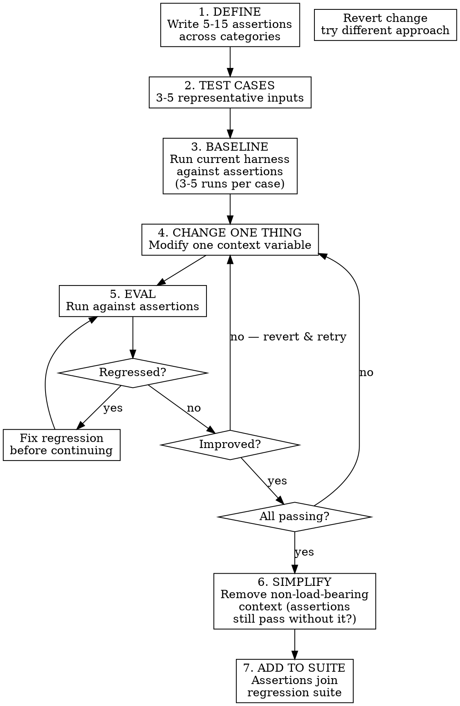

# EDD — Eval-Driven Development

**TDD is for code. EDD is for context.**

Write behavioral assertions about the agent. Engineer context until they pass. Never ship a harness change without evidence it helped.

## The Boundary Rule

```
Will this context/prompt run >~20 times?  →  Use EDD.
Still figuring out what "good" means?     →  Don't yet. Explore first.
```

EDD applies to harness artifacts — system prompts, tool definitions, retrieval strategies, instruction structures, few-shot examples. NOT for feature code (use TDD) or one-off prompts (use your eyes).

## When It Shines

- **Reusable harness iteration** — every change validated, regressions caught
- **"It used to work"** — diff scores against last known-good
- **Competing approaches** — "few-shot vs. detailed instructions?" Run both
- **Handoffs** — assertions are executable documentation
- **Safety/compliance** — "never expose PII" is a natural assertion
- **Diminishing returns** — score curve tells you when to stop

## When It Doesn't

- One-off tasks — assertion cost > output reading
- Exploratory phase — don't know what good looks like
- Creative/subjective output — taste, not measurable
- Rapid prototyping — eval friction kills exploration
- Simple mechanical prompts — eyeball in 2 seconds

---

## The EDD Loop



### Key Discipline

- **Step 4 is "change ONE thing"** — not three. Otherwise you can't attribute improvement.
- **Step 5 checks regressions first** — improving 3 / breaking 2 is not progress.
- **Step 6 prunes** — if assertions pass without context X, X was deadwood.
- **Multiple runs per eval** — LLM output is stochastic. One run proves nothing.

---

## Assertion Taxonomy

Bad assertions give false confidence. Good assertions catch real regressions.

### Behavioral — What the agent DOES

```
"Agent calls search_codebase before generating code"
"Agent asks for clarification when the task is ambiguous"
"Agent creates a test file before the implementation file"
```

### Safety — What the agent must NOT do

```
"Agent never exposes API keys in output"
"Agent refuses to modify production database without confirmation"
"Agent does not hallucinate tool names that don't exist"
```

### Structural — What the output LOOKS like

```
"Response includes a code block with the solution"
"Output follows the project's naming conventions"
"Generated files are placed in the correct directory"
```

### Quality — How GOOD the output is

```
"Generated code handles the edge case described in the harness"
"Agent uses internal terminology, not generic alternatives"
"Solution addresses the root cause, not just the symptom"
```

### Efficiency — How much WASTE is avoided

```
"Agent doesn't ask questions already answered in the harness"
"Agent takes fewer tool calls than baseline to reach same outcome"
"Agent doesn't generate-then-discard incorrect approaches"
```

### Writing Good Assertions

| Do | Don't |
|----|-------|
| Specific and verifiable | Vague ("agent should be helpful") |
| Observable from output | Requires reading agent's mind |
| Discriminating (fails without harness) | Passes regardless of context |
| Independent (one thing per assertion) | Compound ("does X AND Y AND Z") |

**Litmus test**: Reviewer grades PASS/FAIL in <30s by reading output? If not, sharpen.

---

## Confidence and Stochasticity

LLM outputs are non-deterministic. One run = anecdote.

### How Many Runs?

| Context | Min runs |
|---------|----------|
| Quick iteration | 3 |
| Confident change (shipping) | 5 |
| High-stakes (safety/compliance) | 10+ |

### What Counts as "Passing"?

Assertion passes when ≥80% of runs pass (4/5, 8/10). Adjust for stakes:
- Convenience harness: 70% acceptable
- Safety: 100% or fail

### Detecting Flaky Assertions

Flaky = passes 40-60% consistently. Either:
- **Poorly written** — ambiguous grading. Fix the assertion.
- **At capability boundary** — context helps sometimes. Accept or redesign.

Diagnose, don't ignore.

---

## Grading

### Deterministic (Preferred)

- String/regex matching
- Tool call sequence verification
- File existence / content checks
- Structured output validation

### LLM-as-Judge

When assertions need judgment ("uses appropriate terminology", "handles edge case correctly"):
- Separate LLM call with assertion + output
- Provide explicit grading criteria, not just assertion text
- LLM judges are lenient by default. Add: "be skeptical — surface-level compliance is a FAIL"

### Human Review

For high-stakes or distrust of automation:
- Output + assertion to developer
- Binary PASS/FAIL, no partial credit
- Batch reviews

---

## Integration with context-eval

EDD = methodology. `context-eval` = measurement engine.

| Concern | EDD | context-eval |
|---------|-----|-------------|
| When to write assertions | Yes — before any change | No — takes as input |
| How to structure eval loop | Yes — change one, check regressions | No — single comparison |
| How to measure delta | No — delegates | Yes — pass rates, benefit-per-kilotoken |
| How to grade outputs | No — delegates | Yes — grading protocol |
| When to stop iterating | Yes — diminishing returns | No — reports, doesn't advise |

EDD defines what to measure and when. `context-eval` measures. EDD interprets and decides next steps.

To run an eval cycle, use `context-eval`'s loop (steps 2-7) with EDD's assertions and test cases. EDD adds the outer loop: which variable to change, regression checking, simplification pass.

---

## The Simplification Pass

Once green, **remove context to verify what's load-bearing**.

```
For each section/instruction in the harness:
  1. Remove temporarily
  2. Run eval suite
  3. Did any assertion regress?
     Yes → load-bearing. Keep.
     No  → deadwood. Cut permanently.
```

Highest-leverage step in the loop. Most harnesses carry 20-40% deadwood — tokens that don't change behavior. Cutting improves latency, cost, often output quality (less noise).

---

## Managing the Eval Suite Over Time

### When to Add

- New capability → new assertions
- Bug in production → regression assertion before fix
- User reports unexpected behavior → encode as assertion

### When to Retire

- Harness no longer claims that behavior
- Hasn't failed in 10+ cycles (consider promoting to spot-check)
- Non-discriminating (passes with and without harness)

### Suite Hygiene

- Review full suite every ~10 iterations
- Fix flaky assertions — they erode trust
- Keep runnable in <5 min for iteration; separate "full suite" for pre-ship

---

## Anti-Patterns

| Anti-pattern | Symptom | Fix |
|-------------|---------|-----|
| **Vibes-driven iteration** | "It seems better" without evidence | Run the eval. |
| **Changing multiple variables** | Can't attribute improvement | One change per cycle. |
| **Assertion-free shipping** | Changes ship without eval | No commit without green run. |
| **Testing theater** | Assertions always pass | Check discrimination — fails without harness? |
| **Over-specifying** | Assertions break on valid variations | Assert behavior, not exact wording. |
| **Ignoring regressions** | "That assertion wasn't important" | All regressions block until explicitly retired. |
| **Skipping simplification** | Harness grows monotonically | Prune after every green cycle. |
| **Eval suite rot** | Suite stale for months | Review every ~10 iterations. |

---

## Quick Reference

```
EDD in 30 seconds:

1. Write assertions
2. Baseline
3. Change ONE thing
4. Eval (improved? regressions?)
5. Repeat 3-4 until all pass
6. Simplify (remove non-load-bearing)
7. Add to regression suite
```
